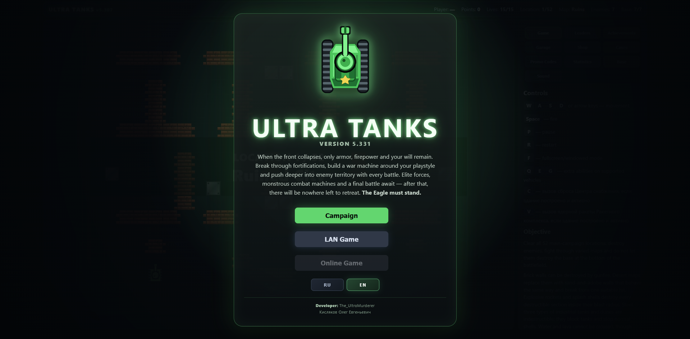
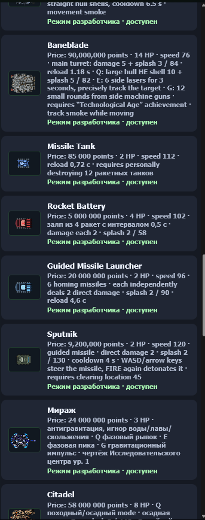
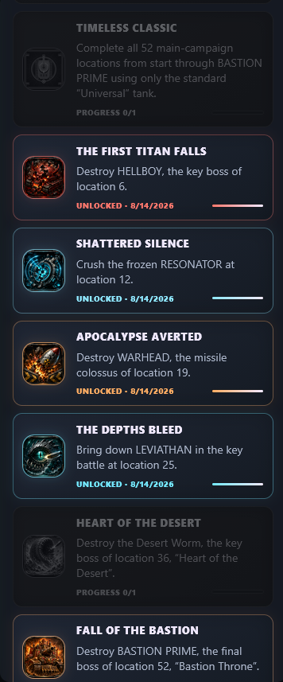
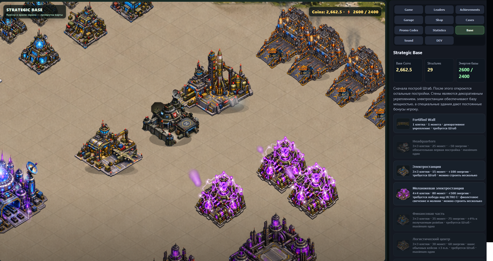
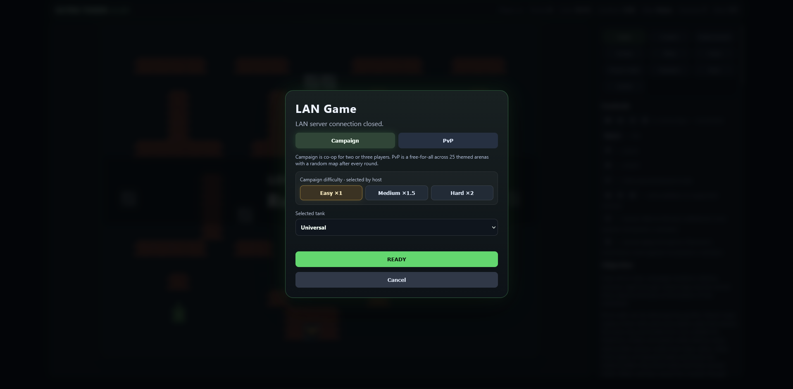
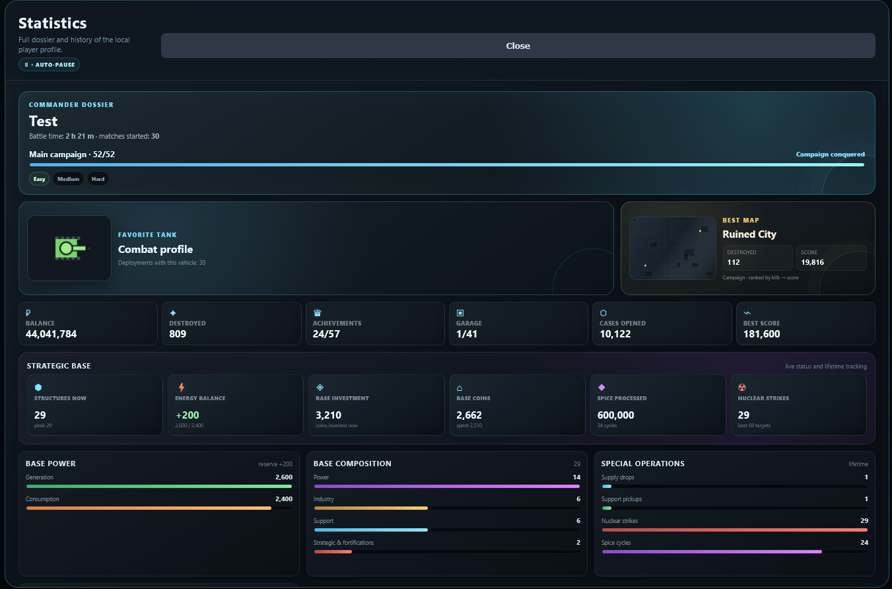

  

<h1 align="center">ULTRA TANKS PC</h1>

  <strong>A classic top-down tank idea, rebuilt into a much larger PC game.</strong> 
  Campaign • Experimental vehicles • Multi-phase bosses • Strategic base • LAN multiplayer

  
  
  
  
  

  

  <strong>English</strong> · <a href="README_RU.md">Русский</a>

---

## A familiar idea — taken much further

**Ultra Tanks** is an independent 2D top-down tank action game inspired by the spirit of classic tank games from the NES / Dendy era.

The starting point is intentionally familiar: a tank, a battlefield, destructible terrain, enemy waves and the constant pressure of surviving one more attack. But Ultra Tanks is **not built as a simple remake**. The original formula has been expanded into a full progression-driven PC game with a long campaign, radically different vehicles, special abilities, secret encounters, multi-phase bosses, a persistent strategic base, research, achievements, statistics and LAN play.

The goal is to preserve the immediate readability of an old-school tank game while continually adding new layers. A vehicle can completely change the rhythm of a battle. A bonus portal can pull the player away from the main campaign into a dangerous boss arena. A building constructed at the strategic base can affect future runs. Research can unlock machines that play nothing like the starting tank. And at the far end of the campaign, the ULTRO battles turn the simple top-down battlefield into a large-scale boss fight.

> **Ultra Tanks starts with a simple tank-game language and keeps asking one question: how far can that idea be pushed without losing what made it fun in the first place?**

---

## The campaign

The PC version contains a **52-level campaign** built around increasingly dangerous enemy compositions, terrain layouts, special encounters and boss fights.

Progression is not just a numerical climb. New tanks introduce different weapon systems, movement styles and Q / E / G abilities, while later encounters demand much more than simply firing faster. Heavy artillery, guided weapons, lasers, plasma, experimental research vehicles and super-heavy machines all create their own combat rhythm.

Alongside the main route are **bonus arenas** and secret encounters. They are optional, but the rewards — and the bosses waiting inside — can significantly change a run.

### Game at a glance

| | |
|---|---|
| **Campaign** | 52 levels |
| **Playable vehicles** | 41 |
| **Bonus arenas** | 17 |
| **Strategic buildings** | 14 types |
| **Achievements** | 57 |
| **Multiplayer** | LAN |

---

## Build a war machine, not just a tank

Ultra Tanks has grown far beyond a single vehicle roster. The garage contains fast assault machines, heavy tanks, artillery platforms, missile systems, Leman Russ variants, secret boss vehicles and experimental machines created through the Research Center.

Some vehicles are straightforward; others are built around an entire mechanic. Abilities can deploy special ammunition, change firing modes, create shields, rewind position, launch guided attacks, summon support systems or unleash battlefield-scale weapons.

<table>
<tr>
<td width="50%" align="center">
   
  <b>Garage</b> — unlock and choose increasingly specialized vehicles.
</td>
<td width="50%" align="center">
   
  <b>Achievements</b> — long-term objectives tied to bosses, vehicles and progression.
</td>
</tr>
</table>

---

## A strategic base that changes the battlefield

  

Between battles, the player can develop a persistent **Strategic Base**. It is not merely a decorative screen: the base is a second progression layer connected directly to the combat game.

Power generation, finance, logistics, research, air support, resource processing and other infrastructure compete for space and energy. A powerful building is only useful while the base can actually support it, so expansion becomes a balance between production and consumption rather than a simple checklist.

A developed base can improve score income, strengthen support systems, unlock experimental research tiers and open access to new tools. In other words, what you build outside the battlefield changes what is possible inside it.

> Grow the base, manage its energy, unlock research and turn campaign progress into a long-term military infrastructure.

---

## LAN multiplayer

  

Ultra Tanks includes **local-network multiplayer**. Players can connect over LAN, select their own vehicles and bring different weapon systems and abilities into the same battle.

The idea is not to turn the game into a separate multiplayer mode with a different ruleset. LAN keeps the same vehicles, abilities and combat identity as the rest of Ultra Tanks, allowing players to combine machines that were originally designed as distinct single-player playstyles.

---

## Bosses, bonus arenas and the ULTRO line

The boss fights are designed as major mechanical breaks from ordinary waves. They use unique attacks, phase changes, arena pressure and special visual/audio effects rather than simply increasing enemy health.

The late-game **ULTRO I, ULTRO II and ULTRO III** encounters push this furthest. They escalate through multiple phases, introduce increasingly large attacks and eventually combine threats that would normally exist as separate boss encounters.

Bonus arenas follow the same philosophy: entering one is a risk, but defeating its boss can produce rewards that would never appear in an ordinary campaign wave.

<!-- When you capture a strong ULTRO/boss screenshot or GIF, place it here.

  

-->

---

## Progress that remembers what you did

  

The game records far more than campaign completion. Statistics track combat progress, score, vehicle usage, strategic-base development and special operations, while achievements turn unusual challenges, boss victories and collection goals into permanent milestones.

This progression layer is meant to make the game feel less like a sequence of disconnected levels and more like one long-running military campaign.

---

## Research and experimental vehicles

The **Research Center** creates a separate progression path for machines that deliberately break the normal vehicle rules.

Research tiers unlock experimental tanks with mechanics such as gravity control, time manipulation, refracted energy weapons, adaptive systems and other abilities that would not fit the standard garage progression. Reaching the highest research tier is therefore more than another purchase: it opens a different class of gameplay.

---

## Download & start

1. Open the repository's **Releases** section.
2. Download the latest Ultra Tanks PC `.zip` archive.
3. Extract the archive without changing the internal `Ultra_Tanks` folder structure.
4. Start the game using the included PC launcher.

  

---

## Current PC build

**Ultra Tanks PC v5.331**

The current build includes the full campaign, vehicle roster, strategic-base systems, bonus arenas, achievements, statistics, research progression, LAN support and the complete ULTRO boss line.

---

  <strong>ULTRA TANKS PC</strong> 
  Old-school tank combat, rebuilt as a much larger game.

